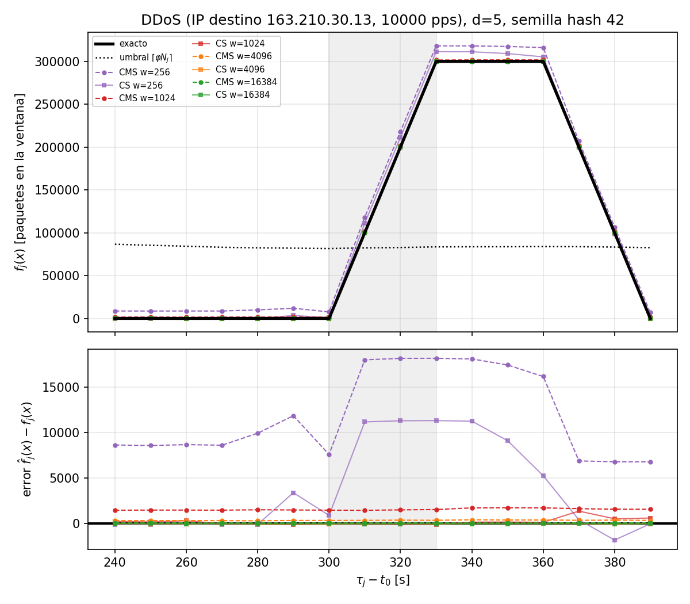
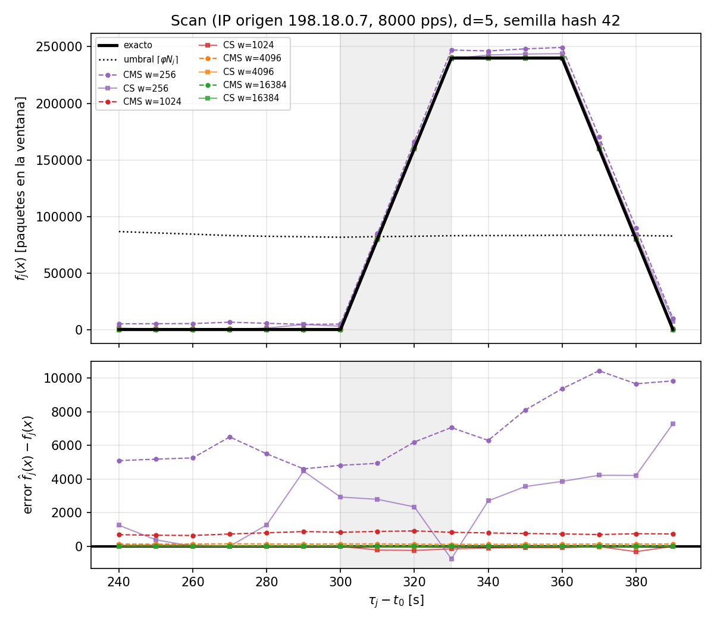
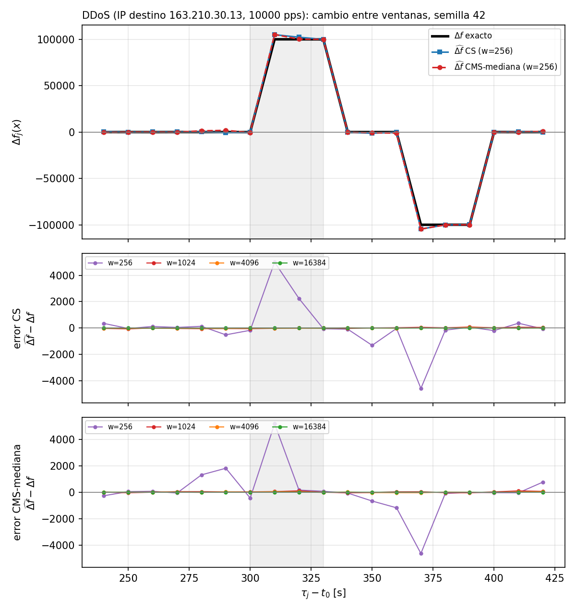
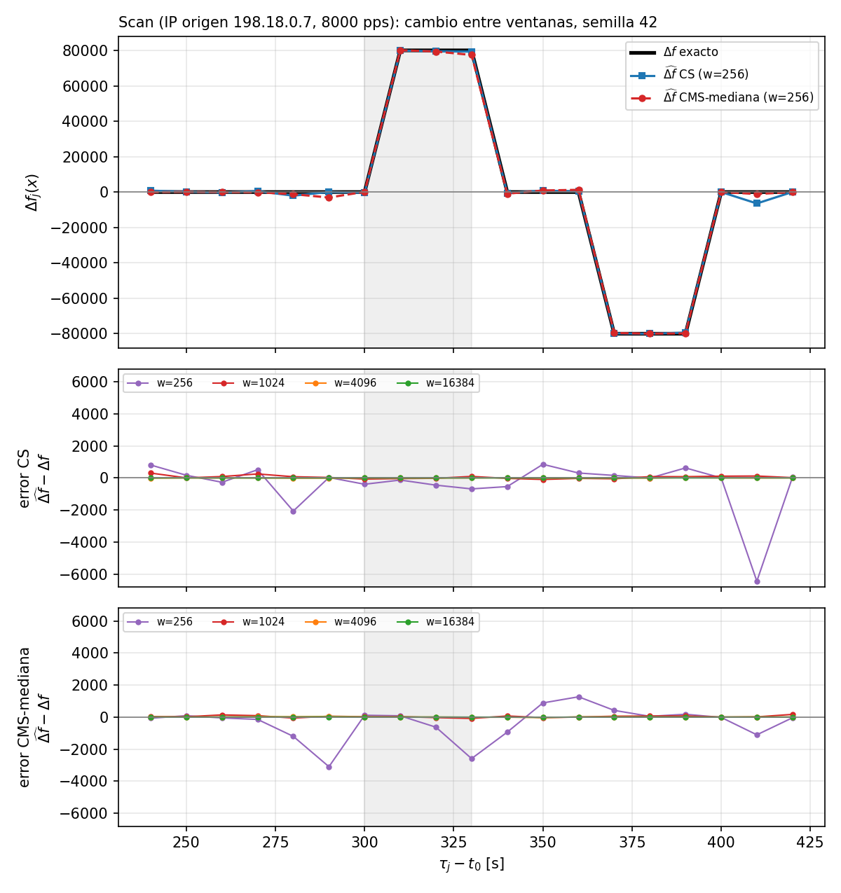

# CMS y CountSketch en ventanas deslizantes para detección de ataques

**Tópicos en Manejo de Grandes Volúmenes de Datos · Tarea 1 · 2026**  
**Integrantes:** [completar nombres] · **Fecha:** 1 de octubre de 2026

## Resumen

Implementamos Count-Min Sketch (CMS) y CountSketch (CS) sobre una ventana de 60 s que avanza cada 10 s. Una traza MAWI de 900 s sirve de base para inyectar un DDoS y un scan de 30 s, ambos desde el segundo 300. La ventana se mantiene con seis sketches de subventana y un agregado; la frecuencia de cada clave se estima sin volver a procesar los paquetes que siguen dentro de la ventana.

Los resultados muestran que el error disminuye al aumentar el ancho. Para los ataques, CS tuvo menor MRE que CMS en las configuraciones principales. Ambos detectaron el DDoS en la misma evaluación que la referencia exacta. En el scan, el ancho 256 produjo falsos positivos antes y después del ataque; con anchos desde 1024, las decisiones coincidieron con la referencia. La memoria de contadores crece linealmente con el ancho y es igual para ambos sketches.

## Datos y configuración experimental

La traza es **MAWI samplepoint-F**, 3 de diciembre de 2018, 14:00: [201812031400.pcap.gz](https://mawi.wide.ad.jp/mawi/samplepoint-F/2018/201812031400.pcap.gz). El archivo local pasó la comprobación gzip y la conversión con `pcap2bin` produjo **123 383 971 registros IPv4** (2 961 215 304 bytes), coincidiendo con los resultados del repositorio. La traza cubre 899,955 s; no se incluye en Git por su tamaño.

Los ataques se generaron con semilla 42, comienzan a 300 s y duran 30 s. El DDoS envía 10 000 paquetes/s desde 4 000 fuentes hacia `163.210.30.13`; se cuenta la IP de destino. El scan envía 8 000 paquetes/s desde `198.18.0.7` hacia 60 000 destinos; se cuenta la IP de origen. Se fija `d=5`, `φ=0,01`, `W=60 s` y `p=10 s`. Los anchos son `w=256, 1024, 4096, 16384`; la semilla de hash principal es 42 y se repite el análisis con 7 y 1234.

## Diseño de la ventana y validación

Cada subventana `q` contiene los paquetes en `(t₀+(q−1)p, t₀+qp]` y usa la ranura `(q−1) mod 6`. Los tiempos se guardan en microsegundos enteros. La primera evaluación ocurre en `t₀+60 s`; por tanto, el anillo ya contiene las seis subventanas de la primera ventana. Un paquete exactamente en un límite queda en la subventana que termina en ese límite; los paquetes en `t₀` quedan fuera, igual que en `exact_hh`.

El agregado `A` es la suma de las seis ranuras. Cada paquete actualiza su ranura y `A`. Al avanzar la ventana se resta de `A` la ranura que expira, se limpia y se reutiliza para la subventana entrante. Por linealidad, la rotación modifica `2dw` contadores, independientemente del número de paquetes de la ventana. Además, un anillo de seis contadores escalares mantiene `Nⱼ` exactamente. El programa compara cada `Nⱼ` con el valor de `exact_hh` y aborta si hay discrepancias: en las corridas registradas coincidieron las **84 ventanas**.

Para el cambio entre ventanas se obtiene `ΔAⱼ=Aⱼ−Aⱼ₋₁` al restar la ranura saliente y sumar la entrante. CS usa su estimador habitual de mediana con signo. Para CMS se informa la mediana de los contadores firmados, llamada CMS-mediana; al trabajar sobre diferencias con signo, esta variante no mantiene las garantías del CMS estándar.

La validación sin ataque considera claves de frecuencia alta, media, media-baja y baja, tanto por origen como por destino, en todas las ventanas. En las claves de frecuencia alta por destino, el error relativo medio de CMS baja de **3,22** con `w=256` a **0,0351** con `w=16384`; para CS baja de **0,846** a **0,00282**. Por origen, CMS baja de **36,9** a **0,164** y CS de **11,5** a **0,0447**. Las claves menos frecuentes sufren errores relativos mayores, en especial con anchos pequeños, porque el ruido de colisión puede exceder su frecuencia real. Las tablas completas están en [`validacion.md`](codigo_entregado/resultados/validacion.md).

## Detección y precisión de frecuencia

El MRE se promedia en ocho ventanas afectadas: evaluaciones posteriores al inicio, antes de que salga de la ventana el último paquete del ataque, y con frecuencia exacta positiva. La tabla presenta la semilla 42. La detección se compara con `exact_hh`; memoria en KiB incluye seis ranuras y el agregado (`7·d·w·4` bytes).

| Ataque | Sketch | w | MRE | Memoria (KiB) | Latencia (s) | FP (ventanas) |
|---|---:|---:|---:|---:|---:|---|
| DDoS | CMS | 256 | 0,0756 | 35 | 10 | 0 |
| DDoS | CS | 256 | 0,0389 | 35 | 10 | 0 |
| DDoS | CMS | 1024 | 0,00863 | 140 | 10 | 0 |
| DDoS | CS | 1024 | 0,00187 | 140 | 10 | 0 |
| DDoS | CMS | 4096 | 0,00210 | 560 | 10 | 0 |
| DDoS | CS | 4096 | 0,0000712 | 560 | 10 | 0 |
| DDoS | CMS | 16384 | 0,000439 | 2240 | 10 | 0 |
| DDoS | CS | 16384 | 0,0000442 | 2240 | 10 | 0 |
| Scan | CMS | 256 | 0,0519 | 35 | 10 | 2 (310, 380 s) |
| Scan | CS | 256 | 0,0217 | 35 | 10 | 2 (310, 380 s) |
| Scan | CMS | 1024 | 0,00543 | 140 | 20 | 0 |
| Scan | CS | 1024 | 0,00127 | 140 | 20 | 0 |
| Scan | CMS | 4096 | 0,000878 | 560 | 20 | 0 |
| Scan | CS | 4096 | 0,000193 | 560 | 20 | 0 |
| Scan | CMS | 16384 | 0,000160 | 2240 | 20 | 0 |
| Scan | CS | 16384 | 0,0000753 | 2240 | 20 | 0 |

Las repeticiones con semillas 7 y 1234 confirman la tendencia general, aunque el error de CS puede fluctuar por su naturaleza aleatoria. La latencia tiene resolución de 10 s. El scan se detecta con mayor claridad a partir de `w=1024`; con `w=256`, CMS supera el umbral en las ventanas 310 y 380 s cuando la referencia exacta no lo hace. Es el falso positivo esperado de un estimador que sobreestima por colisiones. CS también presenta dos falsos positivos en esta corrida por el ruido de sus estimaciones, aunque no tiene sesgo de sobreestimación sistemática.

Al reducir `w`, CMS acumula más colisiones positivas, por lo que su sesgo y error crecen. CS incorpora signos aleatorios: sus errores pueden ser positivos o negativos y fluctuar entre semillas, pero en estos datos su MRE fue menor que el de CMS en todos los anchos y ataques principales. Ambos usan la misma memoria para una configuración dada. La memoria pasa de 35 KiB (`w=256`) a 2 240 KiB (`w=16384`); `dA` requiere almacenamiento temporal adicional, detallado en los logs.

## Cambio de frecuencia `Δf`

El máximo incremento exacto ocurre en 310 s: **+100 008** paquetes para DDoS y **+80 000** para scan. El mayor decremento ocurre en 370 s, cuando el tráfico del ataque comienza a salir de la ventana: **−100 007** y **−80 000**, respectivamente. Así, `Δf` muestra de inmediato el comienzo y el vaciado del ataque, cambios que una serie de frecuencia absoluta amortigua al acumular tráfico de los 60 s anteriores.

Con `w=256`, el error absoluto de CS y CMS-mediana en el incremento de DDoS es 4 996 y 5 190; en el decremento es 4 576 y 4 644. En scan, la mediana CMS fue mejor en el incremento (error 78 frente a 133 de CS), pero peor en el decremento (417 frente a 155). No hay un ganador universal con ancho pequeño. Con `w=16384`, los errores máximos fueron de 0 a 3 paquetes en los extremos de ambos ataques. CS conserva su estimador porque el signo permite tratar diferencias positivas y negativas; la mediana de CMS es una comparación experimental y pierde las garantías estándar que dependen de contadores no negativos y del mínimo.

## Respuestas y conclusiones

1. **Costo de rotación.** La linealidad permite retirar el sketch saliente y sumar el entrante. Se actualizan `2dw` contadores por rotación, sin recorrer los paquetes de la ventana.
2. **Efecto de reducir `w`.** Aumentan las colisiones. CMS se sesga hacia arriba; CS conserva errores con ambos signos y puede variar entre semillas. En las mediciones, CS fue generalmente más preciso.
3. **Ataques y claves.** El DDoS concentra muchos emisores en una víctima, por eso se cuenta `dst`. El scan concentra conexiones en un emisor, por eso se cuenta `src`. El DDoS separa claramente la señal del fondo y ambos sketches igualan la detección exacta; el scan de ancho mínimo muestra falsos positivos.
4. **Información de `Δf`.** Indica cuándo comienza a crecer la frecuencia y cuándo cae al salir los paquetes de la ventana. La frecuencia absoluta puede mantenerse alta durante un tiempo aunque el ataque ya haya terminado.
5. **CS frente a CMS-mediana en diferencias.** CS puede estimar valores firmados usando sus signos y mediana habituales. CMS-mediana admite valores positivos y negativos, pero ya no tiene la garantía de sobreestimación del CMS estándar, pues las diferencias pueden ser negativas y las colisiones dejan de ser sólo ruido no negativo.

## Reproducibilidad

Los scripts, parámetros, ground truth, tablas y figuras están en [`codigo_entregado/README.md`](codigo_entregado/README.md) y `codigo_entregado/resultados/`. La semilla de inyección de ataques es 42; las semillas de hash son 42, 7 y 1234. Las trazas binarias y el pcap se excluyen del repositorio.
